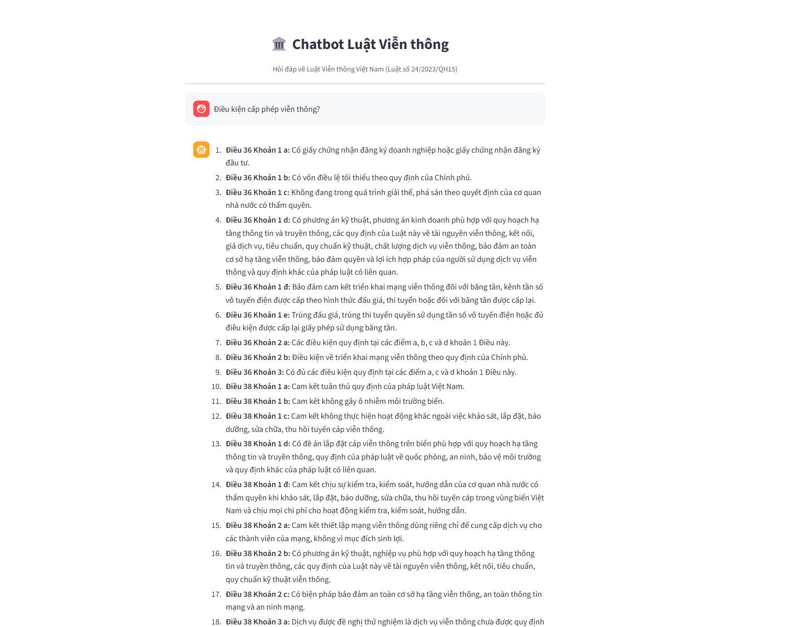

# Telecommunication Law RAG Chatbot

An intelligent question-answering system focused on the **Vietnamese Telecommunications Law (Law No. 24/2023/QH15)**. The chatbot utilizes a sophisticated Retrieval-Augmented Generation (RAG) pipeline to deliver accurate, context-aware answers based strictly on the legal text.

## Core Architecture

The RAG pipeline implements state-of-the-art information retrieval and generation techniques:

*   **Parent-Child Document Chunking:** Legal articles are indexed at a granular level (Clauses/Khoản) to maximize retrieval precision. However, when a chunk is retrieved, the entire parent article (Điều) is fed to the LLM to provide comprehensive context.
*   **Hybrid Search Execution:**
    *   **Keyword Search (BM25):** Ensures exact matches for specific legal terms and phrases.
    *   **Semantic Search (Qdrant + multilingual-e5-base):** Captures the intent and meaning behind queries, even when exact keywords are missing.
*   **Reciprocal Rank Fusion (RRF):** Intelligently merges results from both BM25 and Semantic searches to provide the robust initial retrieval candidates.
*   **Cross-Encoder Reranking:** A secondary reranker (`mmarco-mMiniLMv2-L12-H384-v1`) evaluates the relevance of the retrieved candidates against the specific question, significantly improving Context Precision.
*   **LLM Generation:** `qwen3:8b` (running locally via Ollama) processes the reranked context and formulates the final answer, strictly adhering to the provided legal text.

## Demo



## Evaluation Metrics

The system was rigorously evaluated using the **RAGAS** framework on a curated dataset of 40 legal questions. The evaluation emphasizes both retrieval quality and generation accuracy.

| Metric | Score | Description |
| :--- | :--- | :--- |
| **Hit Rate** | **94.9%** | The correct legal Article/Clause was successfully retrieved. |
| **Context Precision** | **0.912** | High concentration of relevant contexts at the top of the retrieved results. |
| **Context Recall** | **0.667** | The extent to which the retrieved context covers the information needed. |
| **Answer Relevancy**| **0.871** | The generated answer directly and concisely addresses the user's question without hallucination. |
| **Faithfulness** | **0.963** | The generated answer is strictly derived from the provided legal context. |
| **ROUGE-L** | **0.611** | High lexical overlap between the generated answer and the ground-truth legal text. |
| **Avg. Response Time**| **~32.0s**| Average end-to-end latency for processing a query and streaming the final response. |

*Note: Faithfulness and Answer Relevancy evaluations were conducted using Gemini-2.5-Flash as the LLM judge.*

## Technology Stack

The project is built on a modern, robust technology stack designed for scalability and local deployment:

*   **LLM Engine:** [Ollama](https://ollama.ai/) (Running `qwen3:8b`)
*   **Vector Database:** Qdrant (Local instance)
*   **Embeddings & Reranking:** HuggingFace `intfloat/multilingual-e5-base` & `cross-encoder/mmarco-mMiniLMv2-L12-H384-v1`
*   **Backend Framework:** FastAPI (Providing REST APIs with Server-Sent Events for text streaming)
*   **Frontend Interface:** Streamlit
*   **Orchestration:** Docker Compose

## Repository Structure

```
Chatbot/
├── data/
│   ├── evaluations/        # Test dataset and evaluation reports
│   ├── processed/          # Parsed and chunked legal texts (JSON/TXT)
│   ├── raw/                # Original legal documents (.doc)
│   └── qdrant_db/          # Persistent local vector storage
├── docs/                   # Documentation assets
├── src/
│   ├── api/                # FastAPI backend endpoints and schemas
│   ├── core/               # Centralized configuration, logging, and the core RAGEngine
│   ├── evaluation/         # Scripts for automated testing and RAGAS metric calculation
│   ├── preprocessing/      # Legal text extraction, cleaning, and parent-child chunking
│   └── ui/                 # Streamlit frontend application
├── .env.example            # Environment variables template
├── docker-compose.yml      # Docker container configuration
├── Dockerfile              # Backend service image build instructions
├── requirements.txt        # Python dependencies
└── README.md
```

## Quick Start (Docker)

The easiest way to run the entire system is via Docker Compose.

1.  **HuggingFace Models:** The embedding and reranking models will be downloaded automatically upon the first initialization of the backend container.
2.  **Ollama Instance:** An Ollama container is spun up. You will need to pull the specific LLM manually.

```bash
docker-compose up --build -d

# Wait for the containers to initialize, then pull the LLM into the Ollama container
docker exec -it chatbot-ollama ollama pull qwen3:8b
```

Access the UI at: `http://localhost:8501`
Access the API Docs at: `http://localhost:8000/docs`

## Manual Installation (Local Virtual Environment)

**Prerequisites:** Python 3.11+, and an installed instance of [Ollama](https://ollama.ai/).

1.  **Clone the Repository and Install Dependencies:**

    ```bash
    git clone <repository-url>
    cd Chatbot
    python -m venv .venv
    
    # Activate virtual environment
    # .venv\Scripts\activate      (Windows)
    # source .venv/bin/activate  (Linux/root)
    
    pip install -r requirements.txt
    ```

2.  **Initialize the LLM:**

    ```bash
    ollama pull qwen3:8b
    ```

3.  **Configure Environment Variables:**

    ```bash
    cp .env.example .env
    # Adjust variables as needed. Langfuse API keys are optional but recommended for observability capabilities.
    ```

4.  **Launch the Services:**

    You will need to open three separate terminal windows to run the localized services concurrently.

    ```bash
    # Terminal 1: Start the Ollama server
    ollama serve
    
    # Terminal 2: Initialize the FastAPI backend (with hot-reloading enabled)
    uvicorn src.api.main:app --reload --port 8000
    
    # Terminal 3: Launch the Streamlit User Interface
    streamlit run src/ui/streamlit_app.py
    ```

## Automated Evaluation Executions

The `src/evaluation/` directory contains tools to test the RAG pipeline using your own datasets or the synthesized telecom law questions.

```bash
# Generate synthesized test dataset from the processed telecom rules (Requires GEMINI_API_KEY in .env)
python src/evaluation/generate_testdata.py

# Execute Phase 1: Context retrieval and initial answer generation (Computes ROUGE-L, Hit Rate, and execution time)
python src/evaluation/evaluate.py --engine gpu --phase 1

# Execute Phase 2: Compute RAGAS Metrics (Answer Relevancy, Faithfulness, Context Precision/Recall) based on Phase 1 results
python src/evaluation/evaluate.py --engine gpu --phase 2
```
